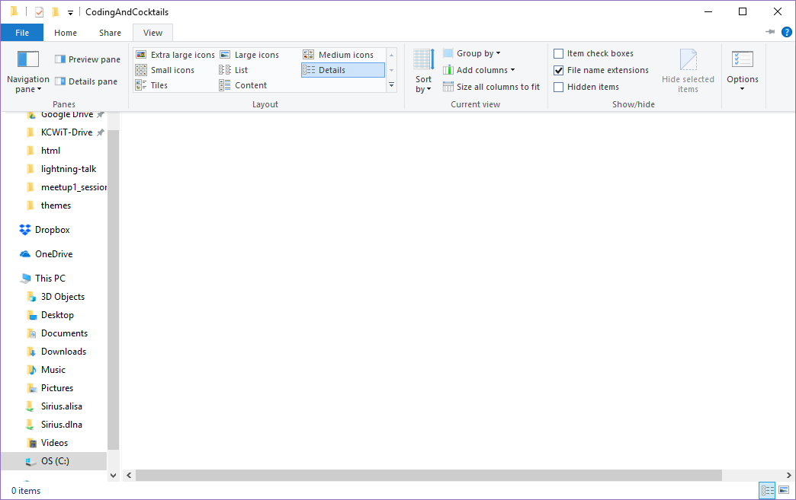

# Organization: Create a Folder For Coding & Cocktails Work

## Create a folder {#create-dir}
Create a folder in your home directory called "CodingAndCocktails". We’ll create folders here for our different projects throughout the year.

We use the terms **"Folder"** and **"Directory"** interchangeably.  They mean the same thing.

**macOS**- Your home directory is typically `/users/yourname` 
**Windows OS**- Your home directory is typically `C:/Users/yourname`. You can use the shortcut `%userprofile%` by typing it into the navigation bar in the File Explorer.

We're using the home directory because terminal applications usually open to home by default. 


<!--sec data-title="Windows Only: Enable viewing file extensions" data-id="section0" data-show=true data-collapse=true ces-->
1. Navigate to the folder you created using **File Explorer**.

1. In the toolbar, select **View** and enable **File name extensions**

<!--endsec-->
