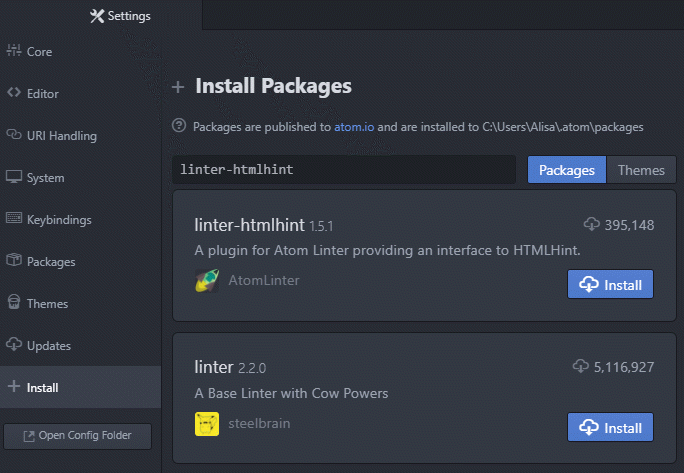

For Mac, select to **Atom** <i class="fa fa-long-arrow-right"></i> **Preferences**.  

In Windows, select to **File** <i class="fa fa-long-arrow-right"></i> **Settings**. 

This will open **Settings** tab where you'll choose **Install** from the left side.
In the "Search packages" input, type in the name of the package and press `Enter`.

#### Install the following packages
* **linter-htmlhint** – provides HTML hints and helps identify potential mistakes

  Search for "linter-htmlhint" and click the **Install** button

* **atom-live-server** – opens a tab in your default browser to view static webpages and automatically refreshes the tab whenever you save changes in Atom

  Search for "atom-live-server" and click the **Install** button


If you are prompted to install any dependencies select **Yes** to install them.
