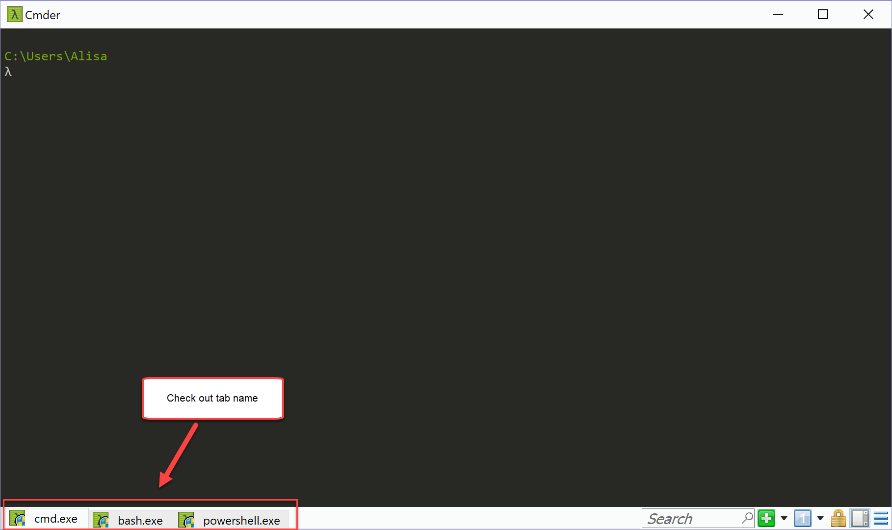
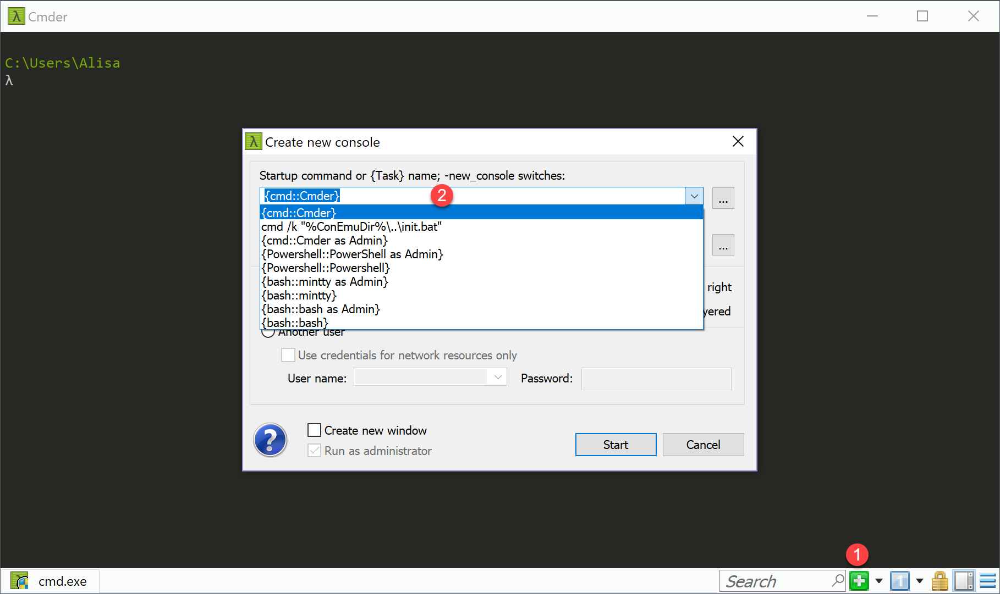
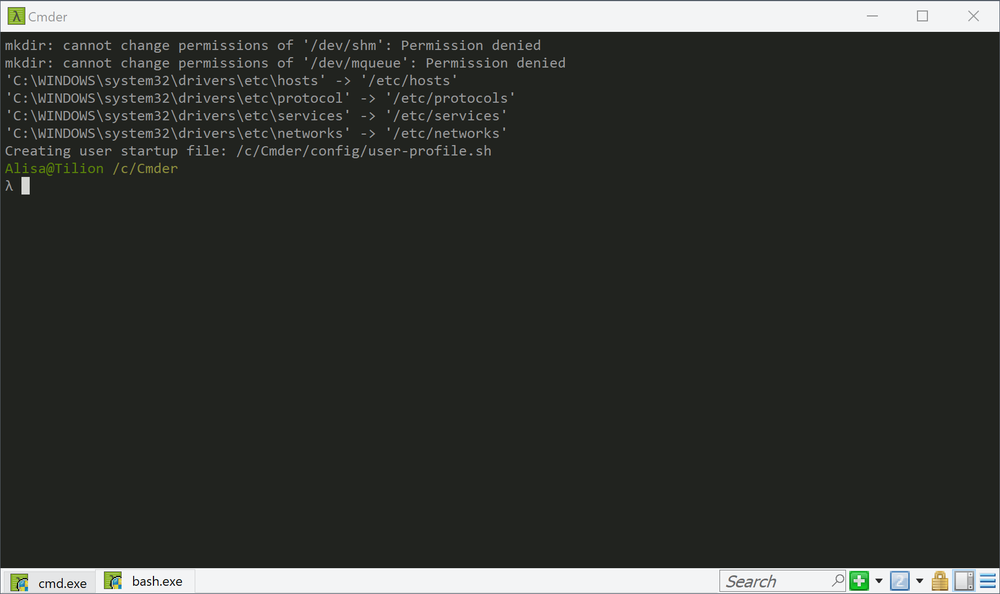
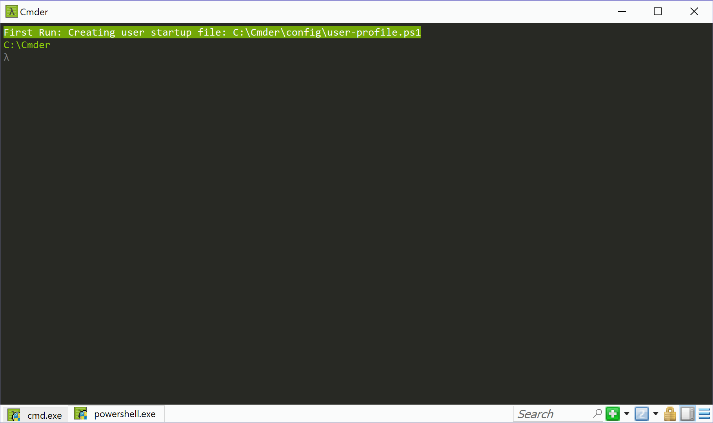

Start Cmder by searching for "cmder" in your taskbar or by selecting Cmder in your Start menu. Right click on Cmder, select **More** <i class="fa fa-long-arrow-right"></i> **Run as administrator**.


Always run Cmder as administrator. Doing so will ensure Cmder has file access it needs for session worksheets.


### Other shells
Cmder wraps different shells (command line interfaces) that makes it versatile. It also includes another tool we use, Git, all packaged together.
The standard shell is Windows cmd shell. It also wraps bash and Powershell. 

Sometimes we use different shells based on our needs. Worksheets will use the standard cmd shell, but it may direct you to use a specific shell on occasion. Luckily Cmder provides an easy to use interface for this. 

You can identify which shell you are using by the tab name. The name of the tab matches the shell it's running.

Follow the instructions below to open different shells.
1. Click on green **+** icon to open **Create new console** dialog. See the picture below.
1. Select the shell you want to start from the **Startup command** combobox. Unless otherwise directed, run your shell as **Admin**.

### cmd Shell
This is the standard shell. You are using Windows cmd but Cmder adds extra functionality. You can use some Linux operating system functionality in this shell. This is the default shell when you start Cmder and most worksheets will use this shell.

Open up a cmd shell. Type `exit` and press the **Enter** key to close the tab.

### bash Shell
This shell best emulates the Linux operating system. It's not an exact match but it's close. You can still use Windows cmd operations in this shell.

The first time you run bash shell, it will make changes on your machine and create a file for your user profile. Open up a bash shell. Type `exit` and press the **Enter** key to close the tab.

### PowerShell Shell
This is the shell that wraps Windows PowerShell. PowerShell is more powerful than Windows cmd shell and has scripting capability built in. PowerShell is most commonly used by System Administrators. You can [read more about PowerShell here](https://docs.microsoft.com/en-us/powershell/scripting/getting-started/getting-started-with-windows-powershell?view=powershell-6).

The first time you run PowerShell shell, it will make changes on your machine and create a file for your user profile. Open up a PowerShell shell. Type `exit` and press the **Enter** key to close the tab.

