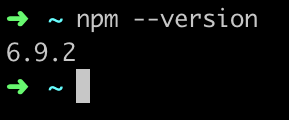

# API Tools- Node and npm


Node is only required for the API session so you may skip installing Node if you are not attending the API session.


Node is a JavaScript runtime - this means JavaScript is no longer confined to a web browser.  You can now run JavaScript on your computer.

npm is a package manager for JavaScript packages.  This allows you to manage and use code from other developers so you don't have to reinvent the wheel and can reuse handy bits of code for common functionality.

## Node
Close Visual Studio Code if you have it open.

In Google Chrome go to [nodejs.org/en/download](https://nodejs.org/en/download). Select the installer for your OS, **Windows Installer** or **macOS Installer**, to download the installer. If you use Linux, download the binaries appropriate for your distribution of Linux.

Run through the installer and select all default options.

Open Visual Studio Code and open the built in **Terminal** by selecting **Terminal**  **New Terminal**. 

Type `node --version` and press `Enter` to execute the command. If you see the version number like the image below (the numbers may be different), the install is complete. 

## npm

npm installs automatically with Node. We will update it just in case you already had npm installed.

In Visual Studio Code's built in terminal, type `npm install npm -g` and press `Enter`.

Check that you have npm installed in Visual Studio's built in terminal by typing `npm --version` and press `Enter`. If you see the version number like the image below (the numbers may be different), 

