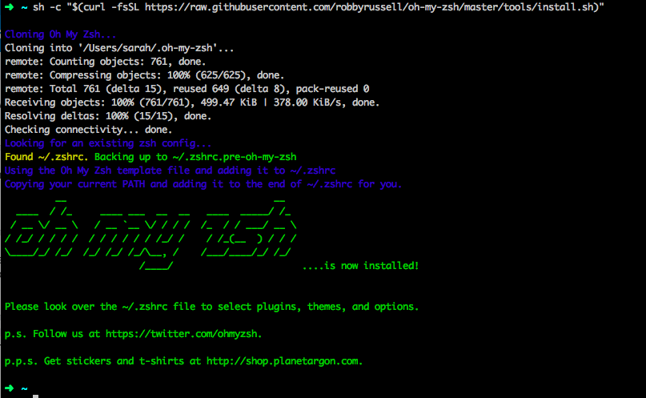

# Command Line Tools

The command prompt is what we use to enter specific commands for some of our tools, such as when we use Git for version control. While point-and-click programs work for many daily uses, when it comes to programming eventually you will need to use the command line to take advantage of the most powerful tools your computer has to offer, so we teach you to get comfortable with it right from the beginning.

<!--sec data-title="Windows" data-id="section0" data-show=true data-collapse=true ces-->

####Git Bash

The default command line tool in windows is the "Command Prompt." You can find it by going to Start&gt;Programs and looking for “Command Prompt”. You can also find it through Windows explorer. However, the windows command prompt does not offer much flexibility and functionality. Because of this, we will use Git Bash, which was installed as a part of your Git installation in the previous step.

<!--endsec-->

<!--sec data-title="Mac" data-id="section0" data-show=true data-collapse=true ces-->

####iTerm2 + oh-my-zsh

The default command line tool on macs is called "Terminal."  For a better experience we will be using iTerm2 + oh-my-zsh

1. Download and install iTerm2 from the following link: [https://www.iterm2.com/](https://www.iterm2.com/)

2. For oh-my-zsh go to the following link: [https://github.com/robbyrussell/oh-my-zsh\#basic-installation](https://github.com/robbyrussell/oh-my-zsh#basic-installation)

    * Copy all of the text in the gray box under the `via  curl` text and paste it at the prompt in iTerm2 and press **&lt;Enter&gt;**[:](https://github.com/robbyrussell/oh-my-zsh#basic-installation)

3. When prompted for a password enter the password that you use to login to your computer. 
>It may look like you’re not typing anything in but this is because it doesn’t want to display your password on the screen for security. Just type your full password and press enter.

4. When the process is complete your screen should look similar to the following \(note the display in ascii art that oh my zsh ….is now installed and you have a nice colorful arrow prompt\):

Oh-my-zsh helps identify certain things with different colors. Here are some of the colors you might run across.

* Your arrow indicating your prompt will be green.

* The name of the directory \(aka folder\) you’re currently in will be displayed in aqua 
\(The above picture shows I’m in my home directory `/users/myusername` indicated by the aqua `~` - a shortcut that references the home directory\).

* If you’re in a git repository your branch name will be displayed in a salmon color.

* If you have uncommitted changes made in the repository that you’re in you’ll see a yellow x symbol at the end of your prompt ine.

<!--endsec-->
