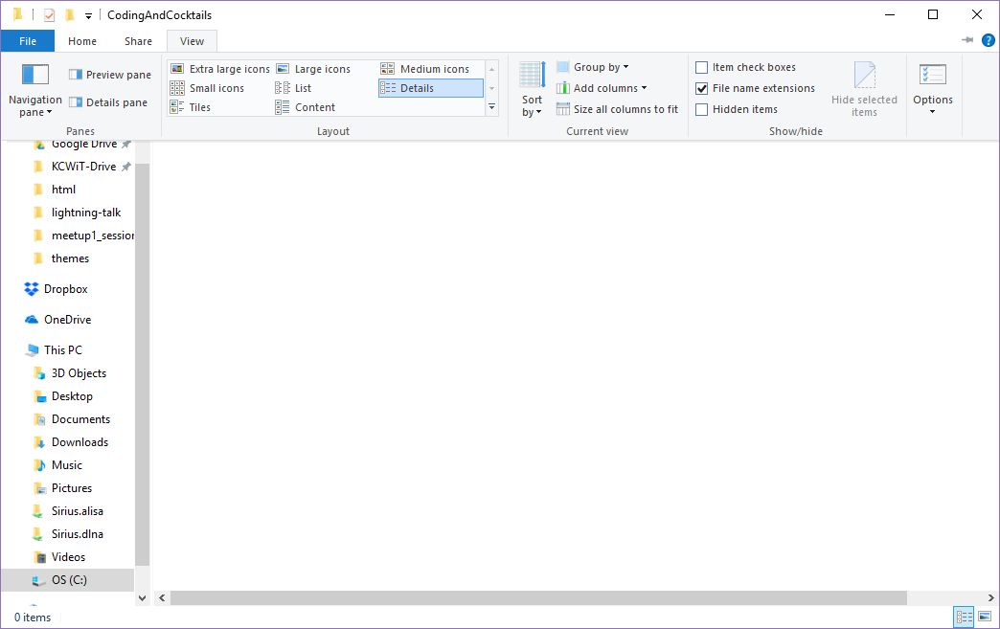

# Organization: Create a Folder For Coding & Cocktails Work

This section will help guide you through the steps listed below. You can check 


## Create a folder {#create-dir}
Create a folder in your home directory called "CodingAndCocktails". We’ll create folders here for our different projects throughout the year.

We use the terms **"Folder"** and **"Directory"** interchangeably.  They mean the same thing.

Your home directory is typically `/users/yourname` on a Mac or `C:/Users/yourname` on a Windows machine.

We're using the home directory because terminal applications usually open to home by default. 


If you want to challenge yourself try creating the directory via the command line instead of through your file explorer!

1. Open your command line tool (**Cmder** for Windows, **iTerm2** for Macs)
2. Navigate to your home directory. In iTerm2 you can use `cd ~`. In Cmder you can use `cd %USERPROFILE%`. In Cmder, your home directory should be the default starting location.

    
`cd` stands for change directory

`~` or `%USERPROFILE%` is a shortcut for your home directory.
    

3. Create your CodingAndCocktails directory by running the command `mkdir CodingAndCocktails`.

    
`mkdir` stands for make directory

Then you provide the name of the directory that you want to create
    

4. If you want to move into that directory use the `cd` command to get there: `cd CodingAndCocktails`.  

   
   You should have used the following commands
   command
   ```bash
   cd ~
   mkdir CodingAndCocktails
   cd CodingAndCocktails
   ```


Most command line terminals (including the ones we use) are not case sensitive - but some are! For our purposes, a folder named CodingAndCocktails is the same as one named codingandcocktails.


<!--sec data-title="Windows Only: Enable viewing file extensions" data-id="section0" data-show=true data-collapse=true ces-->
1. Navigate to the folder you created using **File Explorer**.

1. In the toolbar, select **View** and enable **File name extensions**

<!--endsec-->
