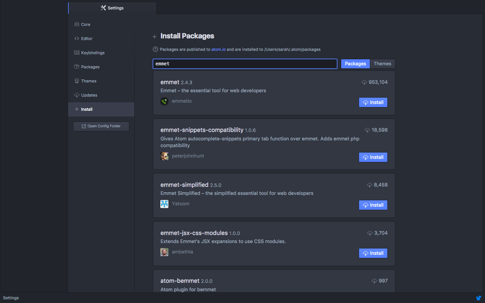
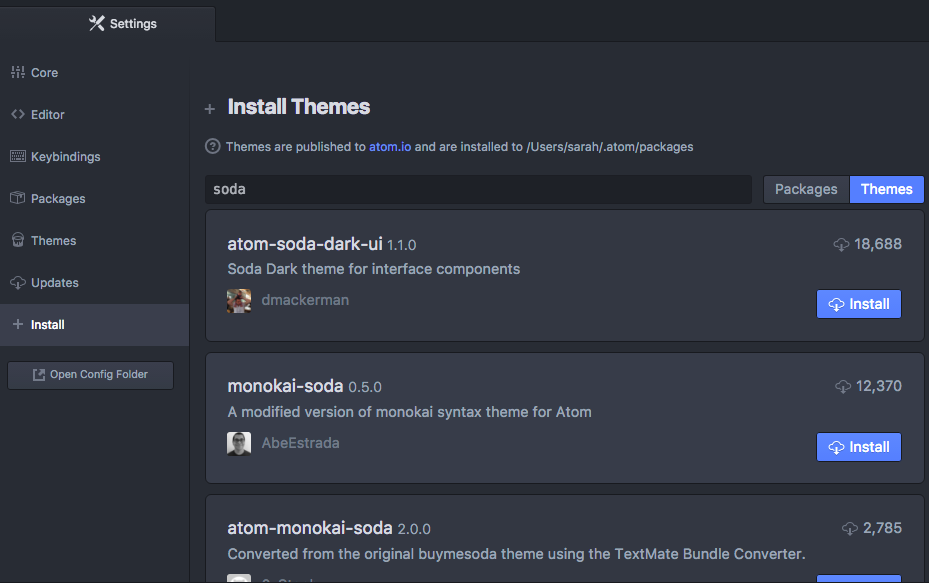
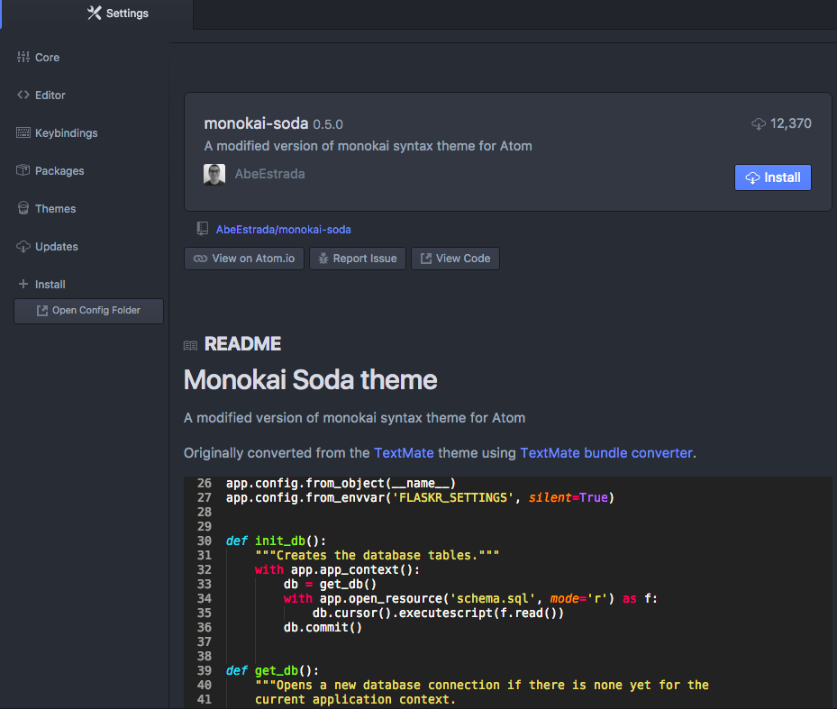

# Text Editor: Atom

Atom is the Integrated Development Environment \(IDE\) we use. After downloading we will configure it with extra tools called _plugins_ that will make your coding life easier.

This section will help guide you through the following steps:


## Download and install Atom {#download}

1. Open the Atom website by navigating to [https://atom.io/](https://atom.io/).

1. Download the file then open it and follow the prompts as they appear. Click **Finish** when prompted to complete the installation.

## Configuring Atom {#configure}
Next, to get the most out of Atom, we need to install packages. The terms "package" and "plugins" are interchangeable in Atom.

If you have ever downloaded and installed a custom font to use in your word processing program, installing plugins is similar. They are features that can be individually installed to enhance your experience.

There are plugins required as part of the session and there are optional plugins you can install to add a little pizzazz in subsequent setup steps.

### Required Packages




## Optional - Review tips for using Atom {#tips}

### Uninstall a Package
 * To uninstall a package open the settings like we did above.  Choose **Packages** from the settings menu and search for the package you’d like to uninstall.  Click on the **Uninstall** button.

### Splitting the Screen
 * Open the **View** menu, choose the **Panes** option then choose how you want to split your screen.

### Keyboard Shortcuts


## Optional - Customize Atom {#customize}
There are optional plugins and themes you can install to help customize your IDE and make it your own.

### Additional Plugins
* **Atom Beautify** - beautify your code.  This means it will add indentations for you to make your code better organized and easier to read.

  Search for "atom-beautify" and click the **Install** button

* **Color Picker** – select colors from within your code

  Search for "color-picker" and click the **Install** button

* **File Icons** - display colorful icons in your project folder display to quickly identify file types

  Search for "file-icons" and click the **Install** button

### Themes
Make it look pretty with themes.

Follow the instructions in the [Required Packages section](#required-packages) to open the **Settings** tab. Click on the **Themes** button next to the search area to search for themes instead of packages.  
  

  Some popular themes include:

  * Soda

  * Dracula

  * Seti

  * Monokai

  _Hint: click on the individual theme sections in the search results to view an example of the theme colors_  
  
