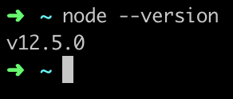

# Node & npm

Node is a JavaScript runtime - this means JavaScript is no longer confined to a web browser.  You can now run JavaScript on your computer.

npm is a package manager for JavaScript packages.  This allows you to manage and use code from other developers so you don't have to reinvent the wheel and can reuse handy bits of code for common functionality.

## Node
Click on the arrow (^) below to expand the section for your operating system.

<!--sec data-title="Windows" data-id="section0" data-show=true data-collapse=true ces-->

1. In Google Chrome go to [nodejs.org/en/download/current](https://nodejs.org/en/download/current/). 

2. Click on the "Windows Installer" option and the installer will download:

3. Run through the installer using the default options provided.

4. In Cmder, check that you have correctly installed Node by typing `node --version` and pressing **Enter**. 

    * If there is a number in the output, Node is installed and you can proceed with the npm section below. The picture may not match your installation version.

    

    * If you receive a command not found message you'll need to troubleshoot what went wrong during your install - grab a mentor to help!  
<!--endsec-->

<!--sec data-title="Mac" data-id="section1" data-show=true data-collapse=true ces-->

1. In iTerm2, type `brew -v`. 

    * If there is a number in the output, proceed with Step 2. The picture may not match your installation version.

        

    * If you receive a command not found message you'll need to install Homebrew as directed in the [Git](/tools-git/README.md) section. 

2. In iTerm2, type `brew update` to ensure Homebrew is up to date.

3. In iTerm2, type `brew doctor` to make sure your system is ready to brew. Grab a mentor to talk through any messages you get from this step that you aren't sure about. 

    
    
4. In iTerm2, type `brew install node` to install Node.

5. In iTerm2, type `node --version`. 

    * If there is a number in the output, Node is installed and you can proceed with the npm section below. The picture may not match your installation version.

    

    * If you receive a command not found message you'll need to troubleshoot what went wrong during your install - grab a mentor to help!  
<!--endsec-->

## npm

npm installs automatically with Node.  Check that you have npm installed in your command line tool \(Cmder for Windows or iTerm2 for Mac\) by typing `npm --version` and pressing **Enter**. 

1. In Cmder or iTerm2, type `npm install npm -g` and press **Enter** to upgrade npm.

