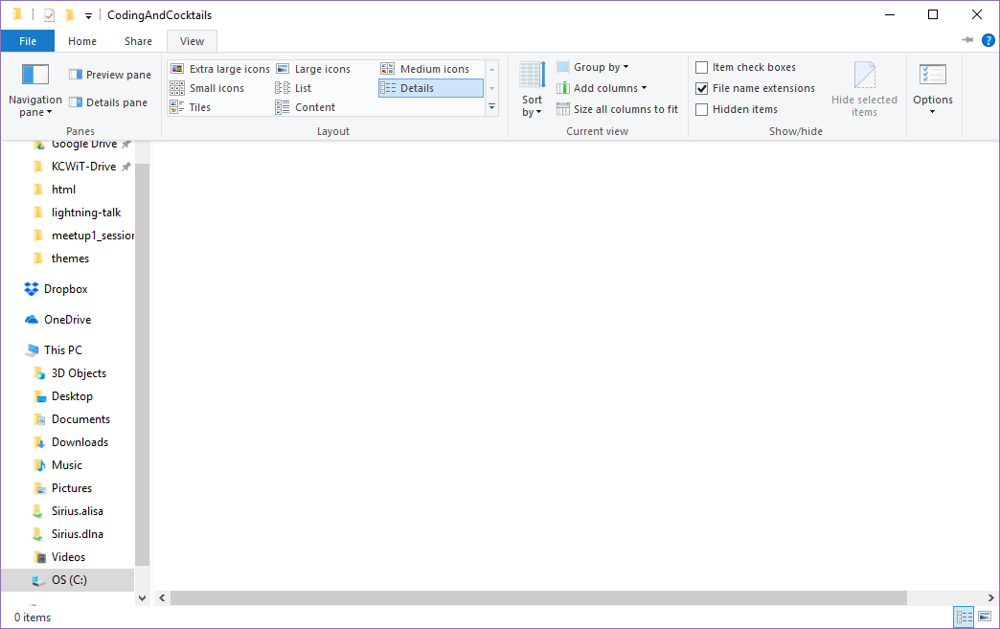

# Organization: Create a Folder For Coding & Cocktails Work

This section will help guide you through the following steps:


## Create a folder {#create-dir}
Create a folder in your home directory called `CodingAndCocktails`. We’ll create folders here for our different projects throughout the year. 

We use the terms **"Folder"** and **"Directory"** interchangably.  They mean the same thing.

Your home directory is typically `/users/yourname` on a Mac or `C:/Users/yourname` on a Windows machine.


## Challenge - Create a folder via command line {#challenge}
If you want to challenge yourself try creating the directory via the command line instead of through your file explorer!

1. Open your command line tool (**Cmder** for Windows, **iTerm2** for Macs)
2. Navigate to your home directory. In iTerm2 you can use `cd ~`. In Cmder you can use `cd %USERPROFILE%`. In Cmder, your home directory should be the default starting location.

    
`cd` stands for change directory

`~` or `%USERPROFILE%` is a shortcut for your home directory.
    
    
3. Create your CodingAndCocktails directory by running the command `mkdir CodingAndCocktails`

    
`mkdir` stands for make directory
    
Then you provide the name of the directory that you want to create
    
    
4. If you want to move into that directory use the `cd` command to get there: `cd CodingAndCocktails`.  


Most command line terminals (including the ones we use) are not case sensitive - but a few are! For our purposes, a folder named CodingAndCocktails is the same as one named codingandcocktails.


## Enable viewing file extensions (Required only for Windows) {#view-extensions}
1. Navigate to the folder you just created using **File Explorer**.

1. In the toolbar, select **View** and enable **File name extensions**

