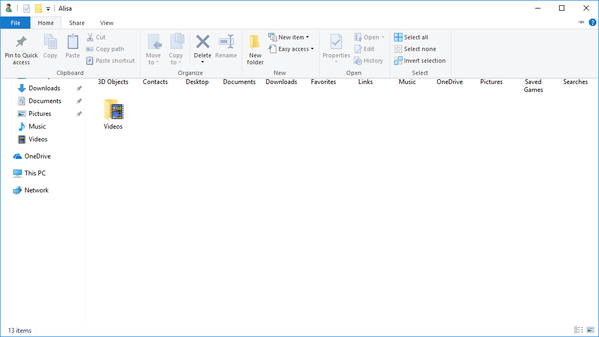
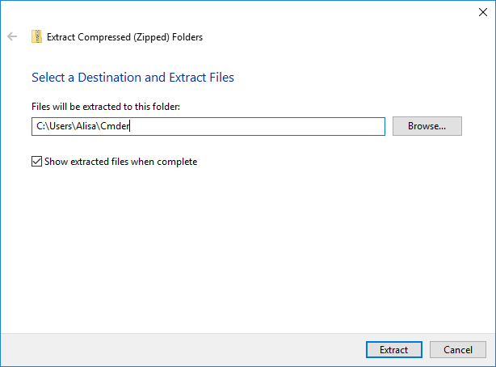
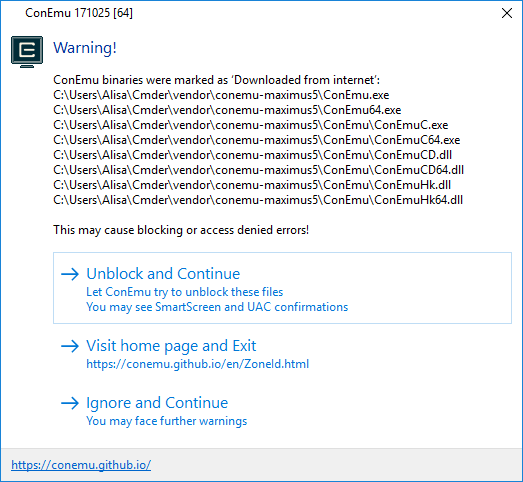
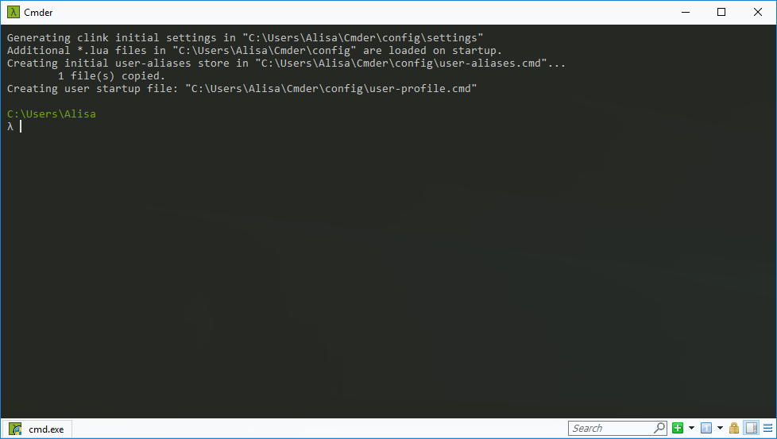
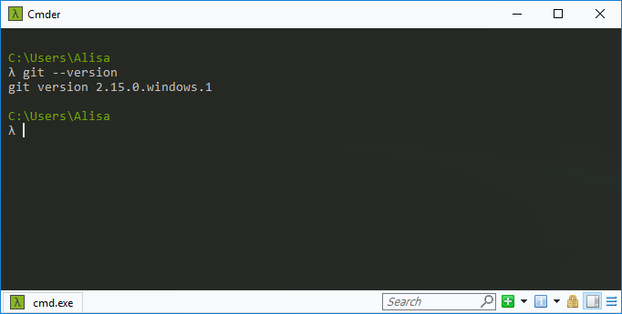

# Cmder

The default command line tool in windows is the "Command Prompt". You can find it by going to **Start**🡒**Programs** and searching for “Command Prompt”. You can also find it through Windows explorer. 

However, the windows command prompt does not offer much flexibility and functionality. Because of this, we will use Cmder. 

Cmder also includes another tool we use, Git, all packaged together. 

This section will help guide you through the following steps:


## Download Cmder {#download}
1. Open the Cmder website by navigating to [https://www.cmder.net/](https://www.cmder.net/).

1. Scroll down to the Download section and click on "Download Full" to download Cmder. This might take a while.

1. While Cmder is downloading, let's get started on creating a folder by opening the **File Explorer**. You can do so by clicking on the yellow folder icon or searching for "File Explorer" in your task bar.

1. Navigate to your home directory by typing it in your file location bar. It is usually `C:\Users\[Your Login Name]\`. 

If you can't find your home directory, type `%USERPROFILE%` in the file location bar and press `Enter`.


1. In the toolbar select **Home** and click on **New Folder**.

   

1. Rename the folder to _Cmder_.

## Extract Cmder {#extract}
1. When download is complete, open your **Downloads** folder and find the compressed folder "cmder".

Sort by "Date modified" if you can't easily find it.

1. Right click on "cmder" and select **Extract All...** and type in the location of your Cmder folder we created previously. Make sure "Show extracted files when complete" is checked and click on **Extract**. When extract is complete, the file explorer will show your Cmder folder.

   

   
Your Cmder folder location should be `C:\Users\[Your Login Name]\Cmder`. If you can't find it, type `%USERPROFILE%\Cmder`.


## Install additional required files {#install}
1.  Right click on Cmder application and click on **Run as administrator**. A User Account Control dialog will pop up. Click **Yes**.
1. Cmder will display an warning dialog asking to install extra files. Click **Unblock and Continue**.

   
1. Cmder screen will display and process the required files in the background. When you see this screen, you're done!

   

## Verify installation {#verify}
1. Close the Cmder dialog by typing "exit" and pressing **Enter** or by clicking on the X in the upper right corner.

1. Search for "cmder" in your taskbar. Windows should suggest "Cmder.exe Desktop app" as a best match. Right click on it and click on **Run as administrator**. A User Account Control dialog will pop up. Click **Yes**.

   
Always run Cmder as administrator. Doing so will ensure Cmder has file access it needs for session worksheets.
 

1. Type `git --version`, press `Enter`, and verify the output looks similar to the picture below.

   

## Optional- Pin to Start menu {#optional-pin}
1. Using the **File Explorer** open the "Cmder" folder in your home directory. You probably already have this folder open from installation.

1. Right click on Cmder application and select **Pin to Start**.

1. When you start Cmder, right click on the pinned icon, select **More** then select **Run as administrator**.

#### Cmder benefits

Cmder helps identify certain things with different colors. Here are some of the colors you might run across.

* Your prompt will look like a lambda \(**λ**\).

* The name of the directory \(aka folder\) you’re currently in will be displayed in olive-green 

* If you’re in a git repository your branch name will be displayed right after the name of the directory you're in.

* If you have uncommitted version control changes made in the repository that you’re in, the branch name will turn red.
