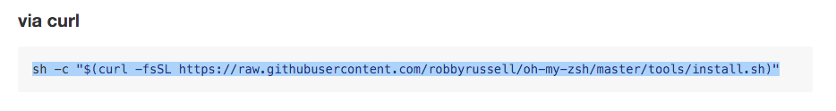

# iTerm2 + oh-my-zsh

The default command line tool on Macs is called "Terminal".  For a better experience we will be using iTerm2 + oh-my-zsh

This section will help guide you through the following steps:


## Download and install iTerm2 {#iterm2}
1. Open the iTerm2 website by navigating to [https://www.iterm2.com/](https://www.iterm2.com/). 

1. Click on "Download" and install.

## Install oh-my-zsh {#oh-my-zsh}
1. Navigate to [https://github.com/robbyrussell/oh-my-zsh\#basic-installation](https://github.com/robbyrussell/oh-my-zsh#basic-installation). 

1. Copy all of the text in the gray box under the `via  curl` text and paste it at the prompt in iTerm2 and press **&lt;Enter&gt;**[:](https://github.com/robbyrussell/oh-my-zsh#basic-installation)

1. When prompted for a password enter the password that you use to login to your computer. 

      
It may look like you’re not typing anything in but this is because it 
doesn’t want to display your password on the screen for security. 
Just type your full password and press enter.
      

1. When the process is complete your screen should look similar to the following \(note the display in ascii art that oh my zsh ….is now installed and you have a nice colorful arrow prompt\):

#### Oh-my-zsh benefits

Oh-my-zsh helps identify certain things with different colors. Here are some of the colors you might run across.

* Your arrow indicating your prompt will be green.

* The name of the directory \(aka folder\) you’re currently in will be displayed in aqua 
\(The above picture shows I’m in my home directory `/users/myusername` indicated by the aqua `~` - a shortcut that references the home directory\).

* If you’re in a git repository your branch name will be displayed in a salmon color.

* If you have uncommitted version control changes made in the repository that you’re in, you’ll see a yellow x symbol at the end of your prompt line.
