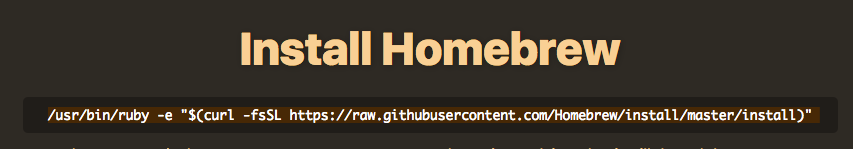
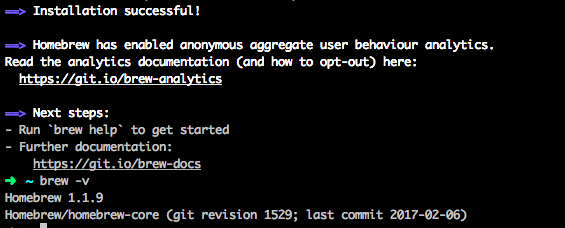

1. Install Homebrew - a package manager to install and manage development software you'll use. 

      1. In Google Chrome, navigate to [http://brew.sh/](http://brew.sh/)
      
      2. Copy the text underneath the "Install Homebrew" header.
      
      
      
      3. In iTerm2 paste the text copied from the homebrew website at the arrow command prompt and press enter.
      
            1. If you are prompted to install Command Line Developer Tools select the "Install" button and accept the license agreement.
            
            
            
            2. At the prompt `Press RETURN to continue or any other key to abort` press return/enter.
            
            3. When prompted, type in the password that you use to login to your computer.
            
            
It may look like you’re not typing anything in but this is 
because it doesn’t want to display your password on the screen 
for security. Just type your full password and press enter.
            
            
            4. The process will run for a few minutes until it is complete.  When finished type `brew -v`.  This should display the version number of homebrew that you have installed. Your screen should look similar to the following:
            
            

2. Install Git
      
      1. In iTerm2, type `brew install git` and press enter.
      
      2. When the process completes, type `git --version` at the arrow prompt to ensure Git was properly installed.  If it is properly installed you should see something like `git version 2.8.3` returned.
      
      3. Now we need to configure our Git version control so that you can use it with GitHub later

            1. At the prompt (the green arrow) set your user name by running the command `git config --global user.name "Your Name"` replacing the text `Your Name` with your own first and last name, keeping the quotation marks.

            2. Next, set your user email addres by running the command `git config --global user.email youremail@example.com` replacing `youremail@example.com` with your own actual email address.
